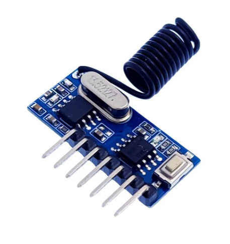

# 📡 Programming Remote Controller

A lightweight, low-cost 433MHz remote control receiver designed for resource-constrained MCUs.

---

## 🔍 Why this project?

You can find hundreds of RF remote decoder codes on GitHub, but this one is built differently. The main goal here was making something production-ready that runs on cheap hardware with minimal RAM/Flash, while supporting multi-channel learning.

Instead of generic chips, this runs on an **FMD MCU** (Fremont Micro Devices, similar to the Holtek family) and uses a standard 433MHz RF module. You can learn any remote on the fly and print the decoded raw hex/binary codes directly in your IDE serial monitor.

---

## ⚡ Core Features

*   **Ultra-low footprint:** Optimized C code tailored for budget MCUs.
*   **Dynamic Learning:** Stores and matches remote IDs without hardcoding.
*   **Multi-Channel:** Easily assign different buttons to separate output relays/pins.
*   **Live Debug:** See exactly what your remote is broadcasting over the air.

The circuit is straightforward. It hooks up a basic 433MHz receiver module to an FMD microcontroller.

## FMD options:
*   **break points**
*   **live register status**
*   **chip price**
*   **simple debug**

## 🛠 Hardware & Wiring

### Board & Schematic

| Receiver Antena | Circuit Diagram |
| :---: | :---: |
|    *433MHz RF Module Setup* |    *MCU and RF Interface* |

---

## 💻 How it looks in the IDE

